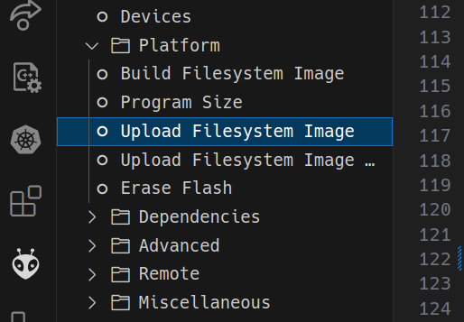

# LittleFS with Platformio and the ESP8266/ NodeMCU

The current manuals are not exact enough for me. I want to use the LittleFS filesystem with the ESP8266 and Platform.io. But for some reason I got no files on the device.

## The problem

I use platform.io with Visual Studio Code. I have a NodeMCU V2 and want to use the LittleFS filesystem. I followed the instructions from the [Platform.io documentation](https://docs.platformio.org/en/latest/platforms/espressif8266.html#uploading-files-to-file-system-littlefs).

I created a `data` folder in my project and put some files in it.

The  I used the `platformio.ini` file to set the filesystem to `littlefs`:

```ini
...
[env:nodemcuv2]
; ...
board_build.filesystem = littlefs
; ...
```

Then I used the Platformio arrow in the bottom left icon-bar of Visual Studio Code to build upload the files to the device.


No I start my program and try to open the files. But they are not there.

## The solution

The arrow does not upload the files to the device. It only uploads the firmware.

To upload the files to the device you need to use the Platformio CLI with

```bash
pio run --target uploadfs
```

This is also available in the Platformio Extension menu on the left side in Visual Studio Code.



That simple, but took me some time to find out. I hope this helps you too - or my future me.
